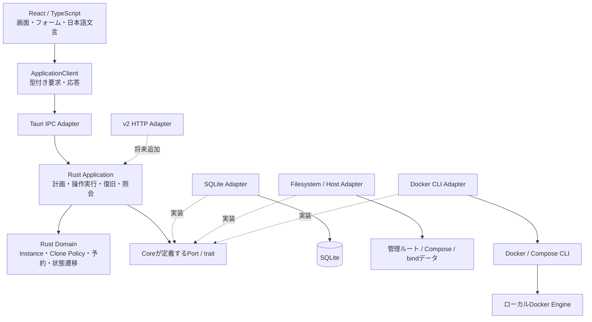
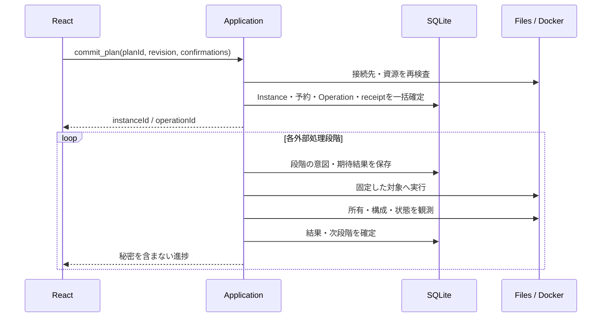

# ComposeNest v1 アーキテクチャ設計

作成日: 2026-09-21\
状態: 初版設計。2026-09-21にOPN-02のUbuntu x86_64限定とOPN-03〜12の推奨方針をユーザーが採用。実装・実機検証は未完了。採用済み方針と残件は14節で区別する。\
上位仕様: [要件定義](requirements-v1.md)、[ドメインモデル](domain-model.md)、[Clone Policy](clone-policy-spec.md)、[Template Schema](template-schema-spec.md)

## 1. 設計の結論

React／Tauri／Rust／SQLiteによる単一デスクトップアプリを構築する。RustをDomain、Application、Adapterに分け、ApplicationとDomainを共通Coreとする。CoreはTauri、WebView、HTTP、具体的なOSパスに依存しない。

SQLiteを設定・予約・処理意図の正本、Composeを再生成可能な実行成果物、Dockerを実行状態の観測元とする。この3つを一括ロールバックできるとは考えず、外部操作前の意図記録と操作後の照合によって復旧する。データ削除による自動復旧は行わない。

v1はローカルの単一利用者・単一Engineである。常駐サーバー、HTTP、メッセージブローカー、イベントソーシングは導入しない。v2はTransportとホスト連携Adapterを追加する構成とし、v1で認証やコンテナ配布を先行実装しない。

| ID | 設計判断 | 対応する主な制約 |
| --- | --- | --- |
| AR-01 | Coreへの入出力を型付きユースケースに限定する | NFR-09・10、FUT-01 |
| AR-02 | 管理ルートごとに1バックエンド、Instanceごとに1未解決Operation | INV-09、MGT-10 |
| AR-03 | 短いSQLiteトランザクションと永続Operation journalを組み合わせる | REC-03〜05 |
| AR-04 | 設定、生成物、実行観測の版と一致状況を分離する | BR-04、INV-07 |
| AR-05 | 保存領域を明示作成し、Composeによる暗黙の再作成を防ぐ | STO-05〜10 |
| AR-06 | CLIの接続先と引数をAdapterが固定する | ENV-03、SEC-06 |
| AR-07 | 作成はコンテナ作成・マウント照合・起動に分ける | TPL-07、INV-02・10 |
| AR-08 | 秘密の正本はSQLite、実行用の複製は保護された生成物 | DEC-03、SEC-01〜05 |
| AR-09 | Deleteは実行資源除去とRetired化。保存領域はRetained | INV-11・13 |

本書と上位仕様で差が見つかった場合は上位の確定方針・安全条件を優先し、理由を記録して本書を修正する。新しいOS対応案や期限はユーザー指定の確定事項とは区別する。

## 2. 全体構成と依存方向



実線は呼出し・利用、点線は実装依存または将来拡張を表す。AdapterがCoreのtraitを実装し、CoreからAdapterの具体型をimportしない。Desktop起動コードだけが具体型を組み立てる。

| 層 | 責務 | 境界 |
| --- | --- | --- |
| React UI | 一覧・詳細・作成・Clone差分・進捗・復旧選択・保持データ表示 | SQLite、OSファイル、Dockerへ直接アクセスしない |
| ApplicationClient | DTOと購読の共通窓口。v1はTauri実装 | UI機能からTauri APIを直接呼ばない |
| Tauri Adapter | IPC検証、許可するウィンドウの制限、イベント配信、終了制御 | Clone評価・予約判断・SQLを置かない |
| Application | Plan管理、ユースケース、排他、トランザクション、Operationの段階進行、照合 | OS／CLI固有の実装をPortへ委譲 |
| Domain | 正規化、Template意味検証、Policy、値・状態・不変条件、Compose中間モデル | ファイルI/O、時刻取得、乱数取得、プロセス起動を行わない |
| Adapter | SQLite、YAML構文解析、Compose出力、ファイル操作、Docker、OS検査 | 業務判断を独自に緩めない |

Applicationの主要コンポーネントはTemplateCatalog、PlanService、InstanceService、AllocationService、OperationRunner、Reconciler、QueryServiceとする。独立サービスとして配備せず、Rustモジュールとして実装する。

主要PortはStateStore（複数台帳を含むトランザクション）、RuntimePort（作成・起動・停止・観測・ログ）、ArtifactStore、StoragePort、HostPortProbe、RuntimeTargetResolver、Clock、RandomSource。業務APIに汎用`execute(command)`、`execute_sql`、任意パス書込みを公開しない。

## 3. 実装リポジトリ構成

以下は実装開始時の構成案であり、現時点で存在するコードではない。

```text
apps/desktop/
  src/                         React features・共通UI・locales/ja.json
  src-tauri/                   起動配線・IPC・capabilities・配布設定
packages/contracts/            Rust DTOから生成するTypeScript定義
crates/
  domain/                      値・状態・Policy・Template意味検証
  application/                 ユースケース・Port・DTO・OperationRunner
  adapters/                    sqlite/ docker_cli/ filesystem/ host/ template/
resources/templates/           配布検証済みTemplateのみ
schemas/                       Template Schemaの機械検証用定義
migrations/                    SQLiteの順序付きmigration
tests/                         契約・Docker結合・中断復旧シナリオ
docs/                          仕様・設計・実機検証記録
```

Coreは通常のCargo workspace内のライブラリとする。契約型はRustを起点に生成し、CIでTypeScriptとの差分を検出する。TS側の型検査だけを実行時検証の代わりにしない。Templateの構造検証と意味検証はRustを正本とし、UIはCoreが返すフォーム定義と検証結果を表示する。

## 4. UIとIPCの契約

### 4.1 コマンドと照会

| 分類 | 主なAPI | 結果 |
| --- | --- | --- |
| 起動・診断 | `get_bootstrap`, `diagnose_runtime`, `get_settings` | 保存情報、前提診断、現在の変更可否 |
| Template | `list_templates`, `reload_templates` | 有効定義と定義別エラー。読み込むだけで起動しない |
| 計画 | `prepare_create`, `prepare_clone`, `update_plan`, `discard_plan` | planId、planRevision、フォーム、秘密を伏せた差分、確認事項 |
| 確定 | `commit_plan`, `get_plan_commit` | instanceId、operationId。受付後の進捗は別照会 |
| 管理 | `start`, `stop`, `restart`, `rename`, `prepare_port_edit`, `commit_port_edit`, `delete` | 更新結果またはoperationId |
| 復旧 | `get_operation`, `retry_operation`, `resolve_operation` | 再試行、旧構成復帰、安全なAbandoned化の可否 |
| 参照 | `list_instances`, `get_instance`, `refresh_instance`, `list_retained_storage` | 各状態軸、観測時刻、所在 |
| 機密・成果物 | `reveal_secret`, `copy_secret`, `read_compose`, `open_instance_folder` | 明示操作の対象だけ。パスはIDからCoreが解決 |
| ログ | `subscribe_logs`, `unsubscribe_logs` | 購読ID、制限付きログ。停止はコンテナ停止と別 |

要求は`apiVersion`、`requestId`、対象ID、必要なら`expectedInstanceRevision`を持つ。計画確定はplanId・planRevision・確認事項への回答を必須とする。初期API版は1。未知の版、余分な実行オプション、対象外フィールドを拒否する。

UIの確認表示だけを根拠にせず、Coreが型、版、利用可能操作、現在の予約、元Instanceを再検証する。Renameも楽観ロックを使う。Deleteには対象版とデータ保持確認を含める。

### 4.2 Planと二重送信

未確定PlanはRust側のメモリーに保持し、画面側はIDとマスキング済み表示を持つ。秘密はlocalStorage、URL、状態デバッグ履歴へ保存しない。Planは明示破棄、画面終了、アプリ終了で消える。暫定上限は同時16件、無操作30分。期限切れは未確定Planにのみ適用し、予約・Operationを期限で解放しない。

確定時は`(scope_id, plan_id)`と確定版を永続化する。同じ版の再送は同じInstance／Operationを返す。別版は不一致として既存結果を案内する。Plan消失後でも確定結果を照会できる。その他の変更要求もrequestIdと非機密の要求同一性情報を保存し、応答断で二重操作にならないようにする。

### 4.3 イベント・エラー

イベントは`operationId / instanceId / revision / sequence / kind`と機密を除いた進捗を持つ。DB確定後に通知する。通知は失われ得るため、再接続・sequence欠落・画面再表示時は照会して復元する。通知だけを成功の証拠にしない。

エラーDTOは`code / fieldPath / reason / retryability / operationId / safeDetails`。Clone Policyの既存エラー分類を継承し、`RUNTIME_TARGET_MISMATCH`、`ARTIFACT_MODIFIED`、`STORAGE_MISSING`、`OUTCOME_UNKNOWN`等を補う。日本語文言はUIのキーへ分離する。生stderr、Spec全体、秘密を含むTemplate評価結果をDTOへ丸ごと載せない。

## 5. 永続化と排他

### 5.1 SQLiteの物理モデル

| テーブル | 主な内容・制約 |
| --- | --- |
| `management_scopes` | scope ID、所有OS利用者、管理ルート識別、既定保存方式 |
| `runtime_targets` | 固定endpoint、Engine識別、platform、診断済み版、接続証拠 |
| `template_revisions` | ID・版・Schema版・正規化方式・意味hash・全Versionの正規形・登録元。IDと版の一意性 |
| `template_revision_files` | revision・相対パスの複合キー、原文BLOB・SHA-256。マニフェストと列挙Versionファイルを保持 |
| `instances` | ID、表示名、正規化名、lifecycle、instance revision、project、target、clone元ID |
| `template_snapshots` | Instance専有の全Versionの完全定義、選択Version、表示順、Schema・正規化・規則版。カタログに削除連鎖しない |
| `template_snapshot_files` | snapshot・相対パスの複合キー、原文BLOB・SHA-256。カタログ原文に外部参照せず専有コピーを保持 |
| `instance_specs` | instance ID・spec revisionの複合キー、入力値（秘密を含む）、Version・保存方式 |
| `port_bindings` | spec revision・slotに対応するポート設定 |
| `storage_allocations` | slot、方式、実体識別、所有証拠、Assigned／Retained、存在・初期化状態 |
| `port_reservations` | 競合scope、IP、TCP、番号、所有Instance、Held／Committed／Released |
| `operations` | 操作意図、状態、段階、attempt、期待版、開始・完了時刻、旧／新spec参照 |
| `operation_steps` | 外部操作前後の記録、command種別、資源ID、結果。引数全文を保存しない |
| `pending_changes` | 旧／新設定、確認済み差分、保持予約。操作と1対1 |
| `request_receipts` | scope・requestId／planId、確定版、Instance／Operationの対応 |
| `artifacts` | artifact ID、spec revision、generator版、manifest、ファイルhash、配置・公開状態 |
| `image_resolutions` | 要求Image参照、取得digest、image ID、platform、初回解決Operation |
| `runtime_observations` | 最新の必要な観測のみ。観測時刻と鮮度。無加工inspect JSONは保存しない |

設定とSnapshotの構造部分は版付きJSONで保持する。競合判定キー、外部キー、状態、版は列にする。JSON内の台帳を検索して排他の代わりにしない。

必須制約は、非Retiredの正規化表示名の部分UNIQUE、全履歴を通じたtarget・projectのUNIQUE、有効ポート予約の部分UNIQUE、instance・slotの保存領域UNIQUE、未解決Operationのinstance別部分UNIQUE。未解決にはFailed／AwaitingDecision／OutcomeUnknownを含み、Succeeded／Abandonedだけを完了扱いとする。同じ公開先を引き続き使用する編集では予約を追加せず既存行を参照し、変更slotだけHeldを追加する。

bindパスの親子・リンク関係はUNIQUEだけでは判定できない。実体検査と台帳検査を併用する。clone元IDは由来であり削除カスケードを設けない。RetiredのSnapshot・設定・成果物参照は保持する。

### 5.2 トランザクション境界

`foreign_keys=ON`、`journal_mode=WAL`、`synchronous=FULL`を採用する。書込みは1専用キューへ集約し、読取りは短いsnapshotで行う。WAL関連ファイルも秘密を含む管理データとして保護する。WALは共有メモリーを利用するため、管理DBをネットワーク共有上に置かない。[SQLite WAL資料](https://www.sqlite.org/wal.html)

外部検査後に`BEGIN IMMEDIATE`で元Instanceの版・操作状態、名前、全資源を再確認し、Instance・Spec・Snapshot・割当て・Committed予約・Operation・request receiptを一括確定する。競合すれば全体をロールバックしてPlan再確認へ戻す。CLI実行やポート探索をDBトランザクション内で待たない。

OSによる管理ルートの排他ロックを起動から終了まで保持する。PIDファイルの存在だけで排他としない。別起動は既存ウィンドウを前面へ出すか、利用中と案内する。アプリ内はInstance mutexとDB制約を併用する。別Instanceの操作は暫定2件まで並行し、読取り・ログは変更キューと分離する。

### 5.3 Migration

起動時にschema versionを確認し、排他取得後、migrationをトランザクション適用する。未知の新しい版への書込みや自動downgradeは拒否する。事前退避はSQLiteの整合したバックアップ手段を使用し、稼働中のDBファイルだけをコピーしない。退避は同じ権限で保護し、成功確認後の整理を配布手順に含める。これは内部更新用で、DBサービスのBackup／Restore機能は追加しない。

## 6. 管理ルート・生成物・秘密情報

### 6.1 配置

WindowsはProgramData既知フォルダー配下のComposeNest、Ubuntuは`/var/lib/composenest`、macOSは`/Library/Application Support/ComposeNest`を採用する。他OSパスは本書の設計判断として具体化したもの。

```text
<management-root>/
  owner.json                         scope・所有利用者・配置版（秘密なし）
  locks/backend.lock
  state/composenest.sqlite            設定・秘密・予約・処理記録の正本
  templates/local/<package>/         template.yamlとversions/*.yamlの読込み対象
  instances/<instance-id>/
    artifacts/<artifact-id>/
      compose.yaml                   標準Compose、秘密を含み得る
      manifest.json                  設定版・生成版・ファイルhash
    recovery/<recovery-id>/           明示復帰時の変更前ファイル
  data/<instance-id>/<slot>/          bindデータ。ここだけをRWマウント
  ownership/<instance-id>/<slot>.json bind実体の所有証拠、コンテナには非公開
  staging/<operation-id>/             生成途中の保護されたファイル
  diagnostics/                       機密を除いたアプリ診断
```

配布Templateはアプリの読取り専用resourceに置き、登録元をアプリ側で付与する。localフォルダーに同じIDを書いても同梱扱いにしない。同一ID・版の重複は無効として示す。既存InstanceはSQLite内Snapshotを使う。

Retiredになってもデータや生成物を移動しない。保持一覧からbindパス、volume実名、元設定の所在を参照する。named volumeの内容はDocker管理領域にあり、このツリーへ移さない。

### 6.2 権限と初期導入

通常のGUIは管理者権限を持たない。インストーラーまたは初回セットアップ専用の昇格処理が管理ルートだけを作成し、明示された1利用者へ付与する。Docker設定・グループ参加・既存データの再帰chownを自動変更しない。

Windowsは所有SID、SYSTEM、Administratorsに限定したACLを設定し、一般Usersへの継承を外す。macOS／Ubuntuは所有利用者の管理ディレクトリを0700、秘密を含むファイルを0600相当とする。OS管理者からの秘匿は保証しない。昇格時の実行者を管理利用者と誤認せず、起動元のSID／UIDを明示して検証する。

bindデータはアプリ状態領域と権限を分ける。rootful EngineではImageの初期化処理によってデータの所有UIDが変わり得るため、データ内部の所有者がGUI利用者と同じことを必須としない。親ディレクトリの管理と実体識別を保ち、各ImageのUID/GIDとDocker Desktop共有の挙動を実機検証する。全員書込み可能にする回避策は採らない。権限不適合なら停止し、新規作成時のnamed volume選択を案内する。

### 6.3 正本・生成・改変検出

秘密の正本は`instance_specs`。生成Composeのenvironment／commandにも必要な実値を出力する。v1では別の`.env`や秘密キャッシュを作らず、必要な平文複製をこの生成物に集約する。SQLiteのWAL、migration退避、復帰用ファイルにも秘密が残り得ることを扱う。

Artifactは版ごとに不変のディレクトリへ生成する。DBへ生成意図・期待hashを記録し、同一ファイルシステムのstagingへ排他的に書き込み、flush後に公開する。公開先が既存なら上書きせずhashを照合する。ディレクトリ公開とDB参照切替えの間で落ちた場合はmanifestとjournalから照合し、部分生成物を実行しない。Windowsのファイル置換、ウイルス対策ソフトによる占有、容量不足も失敗として記録する。

SQLite内manifestを照合基準とし、manifestファイル自身もhash対象にする。Compose、補助ファイルの相対パスと生バイト列のSHA-256を保持する。書換えだけでなく欠損、リンクへの差替え、参照範囲外ファイルも拒否する。DBに記録されたartifact IDから絶対パスを解決し、CLIの作業ディレクトリ探索に任せない。

外部編集があればStart／Restart／EditPort／再生成を保留する。Stopはコンテナ所有を検証できればファイルを使わず実行できる。管理再開は、保存設定へ戻す差分を明示し、確認した変更ファイルのhashを再検証して保護されたrecovery領域へ退避、新しいArtifactを生成・検証する。外部Composeを正本へ取り込まない。コンテナの構成も異なる場合は所有を確認したStopと、停止状態での再作成を同じ復旧Operationで行う。所有不明なら保留する。recoveryファイルは自動実行しない。

## 7. Template処理とCompose生成

Schema 1は共通メタ情報・Version一覧のtemplate.yamlとVersion別完全定義のパッケージを標準とする。未実装の単一ファイル案は受け付けず、互換Adapter・移行機能は設けない。読込みはマニフェストのサイズ制限付きUTF-8 → YAMLイベント・構造検査 → 列挙Versionファイルの安全な受付 → 全文書の型付きAST → 全Version意味検証 → 正規形 → 全体登録の順とする。展開前にalias・anchor・独自タグ・重複キー・複数文書・深さ超過を拒否できるパーサーを選ぶ。ライブラリ標準のYAML読込みだけで仕様を満たすとはみなさない。数・文字列・未設定の区別、未知キー拒否、マニフェストとVersion文書の許可キーはTemplate仕様に従う。継承・差分マージは行わない。

正規化方式を`template-normalization-v1`とする。型付き内容をUTF-8の安定JSONへ直列化しSHA-256を計算する。オブジェクトキーは一定順、表示順の意味があるinputs／versions／connections／slotは順序配列を別途保持しhashに含める。意味hashにはマニフェストのメタ情報と全Versionの完全定義を含める。コメント・空白・参照ファイルの配置名は除外するが、ラベル・既定値・Policy・表示順は除外しない。原文hashは各ファイルの生バイト列から別計算し、同内容の再登録で既存原文を上書きしない。出所情報はアプリ側で別保存し、Template作者の自己申告を信頼判定へ使用しない。

### 7.1 パッケージ受付と保存

filesystem／template Adapterは同梱resourceとtemplates/local直下のパッケージのtemplate.yamlだけを検出し、versions/<name>.yamlへの明示参照を読む。Versionファイルを独立Templateとして走査しない。パス文法・予約名・リンク拒否・実体検査・重複参照・1ファイル256 KiB／全体8 MiB／33文書の上限はTemplate仕様11節に従う。開いたハンドルに基づく範囲・通常ファイル確認、取得中の変更検知をOS Adapterへ隔離し、3OSで検証する。

全原文のバイト列集合を固定してから意味検証・確認へ渡す。取得中の変更や差替えを検出した集合は破棄し、確認後に元ファイルを再読込みしない。全Versionが成功した場合だけ、Application Serviceがrevisionと全原文行を1つのSQLiteトランザクションで登録する。1件の欠損・不正でパッケージ全体を拒否し、他Template・既存登録版・Instanceを維持する。失敗した再読込みを旧版の表示で成功と見せない。

Instance確定時は全Versionの完全定義・表示順・規則版と原文集合をSnapshotへコピーし、Spec・割当てと同じ確定トランザクションで保存する。カタログ削除によるSnapshotの削除連鎖・外部参照は設けない。Cloneの選択肢は保存済み全Versionに限定し、カタログ更新による追加はしない。

Reactは検証済みDTOと選択Versionのフォームだけを扱い、ファイル探索・マージを実装しない。新規作成の追加項目には初期化規則、CloneにはPolicyを適用する。削除項目を送信対象から除外し、候補・slotを再検証して確認を無効にする。秘密を無言で再生成しない。

### 7.2 Compose生成

生成器は外部のTemplateファイルを再読込みせず、Snapshot内の選択Versionの完全定義＋確定Spec＋保存割当て＋Image解決記録から型付きComposeモデルを作り、YAML serializerで出力する。文字列連結でYAMLを作らない。`$`をCompose補間で変質させず、commandはargv配列、healthcheckはexec形式とする。入力値を再度Template構文として解釈しない。[Composeサービス仕様](https://docs.docker.com/reference/compose-file/services/)

| 生成項目 | 固定方針 |
| --- | --- |
| Project／service | `cn-<32桁Instance ID>`／`main`。container_nameなし |
| ports | long syntax、host_ip=127.0.0.1、protocol=tcp、予約済み番号 |
| bind | long syntax、slot専用絶対パス、`bind.create_host_path: false` |
| named volume | Coreが先に作成した実名を`external: true`で参照 |
| network | Project専用default。共有network指定不可 |
| labels | `io.composenest.scope`、`instance`、`spec-revision`、`allocation`等を資源種別に応じ付与 |
| runtime policy | Templateが許すrestart、memory、healthcheckのみ |

`external: true`は生成器内部の選択であり、Template作者へ既存volume参照機能を開放するものではない。bindの自動ディレクトリ作成抑止は欠損時の空DB作成を防ぐ目的で使う。[Composeのvolumes仕様](https://docs.docker.com/reference/compose-file/volumes/)

生成後は固定したファイルに対してCompose構成検証を行い、失敗時はコンテナ作成へ進まない。平文を含む検証出力を通常ログへ流さない。検証済みArtifactもCLI直前にhashを照合する。

## 8. Docker・OS Adapter

### 8.1 実行対象とプロセス起動

初回診断でCLIとComposeの存在・版、Engine接続、Linuxコンテナ、platform、ローカルendpointを確認する。v1はunix socket／Windows named pipeと検証したDocker Desktopのローカル接続を対象とし、ssh／tcpのリモート接続は受け付けない。

Context名だけでなく、解決したendpoint、EngineのID、OS／architecture、管理scopeとの対応を保存する。操作ごとに固定endpointへ接続し、Engine IDを照合する。`DOCKER_HOST`、`DOCKER_CONTEXT`、TLS関連・Compose関連の外部環境変数によって対象が変わらないように実行環境を構成する。Context切替えがCLIに影響することを踏まえ、利用者のcurrent contextを変更せず明示接続する。[Docker Context資料](https://docs.docker.com/engine/manage-resources/contexts/)

Engine再導入でIDが変わった場合は全変更操作を止める。v1で既存Instanceを新Engineへ自動付替えしない。再登録は旧管理データ・残存領域を保全する別手順が確定するまで保留し、誤った対象へのStartやDeleteを防ぐ。

CLIは検出した絶対パスの実行ファイルをRustのプロセスAPIと引数配列で起動し、shell／cmd／PowerShellを挟まない。Windowsはウィンドウを表示しない。作業ディレクトリ、`--host`、`--project-name`、`--file`、`--project-directory`等をAdapterが決める。カレントディレクトリの`.env`を読ませず、保護された空のenvファイル等で明示的に無効化し、対応版で確認する。

秘密値をホストCLIの引数や環境変数に載せず、Composeファイルから渡す。ただしRedis例のコンテナ内commandやDocker inspectには秘密が存在し得る。ホストCLI引数の保護と、Docker権限を持つ利用者からの秘匿を混同しない。

プロセスID・起動時刻・操作種別・子プロセス終了を追跡し、stdout／stderrを常時上限付きで排出する。タイムアウト後もdaemon処理の取消しを仮定せずOutcomeUnknownとして照合する。OSのプロセスグループ／Job管理を使い、前試行のCLI終了を確認できるまで変更コマンドを重ねない。

### 8.2 実体の所有と状態照合

Project名、Compose管理ラベル、アプリscope／Instanceラベル、記録済み資源ID、実際のポート・マウント・Imageを合わせて照合する。ラベルは認証署名ではなく管理証拠であり、Docker管理者が自由に変更できるという限界がある。

観測は構造化したinspect結果を許可フィールドへ投影する。存在、State、Health、ポート、Mounts、Image ID、ラベル、networkを扱い、Env／Cmd全文やhealthcheck出力は通常DTOへ流さない。Engine接続失敗はUnknown、存在しないことを確認した場合のみAbsent。UIへは観測時刻と現在の鮮度を返す。

`spec-revision`ラベルだけでは一致としない。生成モデルから期待するImage・マウント・ポート・command・environment・healthcheck等と実体を照合し、秘密値の比較結果だけを返す。Dockerが付ける既定値の正規化はAdapterの契約テストで固定する。

### 8.3 保存領域とポート検査

bindは固定したdata配下で、親ディレクトリから実体を追跡する。Unixではディレクトリhandleとdevice／inode、Windowsではvolume／file IDとreparse point検査を用い、文字列prefix比較で安全判定しない。新規作成は排他的mkdir、所有証拠はコンテナへ見せない兄弟領域に保持する。作成後DB記録前に落ちて証拠が足りなければUnverifiedとして止める。同一利用者や管理者による検査直後の改変まで完全に排他できるとは約束しない。

named volumeは`cn-<instance-id>-<slot>`を明示作成し、scope／Instance／slot／割当て操作のラベルを付けてinspectする。同名があっただけでは採用しない。作成APIの再送で既存volumeが返っても、自分の記録と一致する場合だけ続行する。過去Presentの領域はMissing時に作成APIを呼ばない。

ポートは台帳、Dockerの公開設定、ホストOSのbind検査を併用する。SO_REUSEPORT等で競合を隠さず、Windowsでは排他的bindを使い予約範囲も考慮する。IPv4全体の待受、IPv6 dual-stack、権限・OS制限も拒否または判定不能へ分類する。検査用socketは解放し、アプリ予約とOS占有を混同しない。

探索順はClone Policy仕様を維持する。暫定で1要求256候補／2秒を上限とし、到達時は「空きなし」ではなく検査未完了を返す。続行は保持したcursorから順序を守り、範囲末尾で巻き戻さない。確定時と起動直前に再検査し、それでも残る競争は起動失敗後の確認付きポート再提案で扱う。

### 8.4 Image取得と再現性

選択したタグ／digestをSpecへ保持する。初回取得では明示pullしてplatform、RepoDigest、image IDを記録し、同じInstanceの再作成・再試行に使う実行参照を固定する。タグのSpecを書き換えず、解決記録を別に保持する。digestを取得できず内容を固定できない場合は作成を保留し、別タグへ自動変更しない。

Artifactのimageには記録済みの実行用digestを使用し、コンテナ作成は`--pull never`とする。ローカルImageが消えた場合は保存digestを明示取得して同一platformを照合する。初回取得後・解決記録前の中断では、まだコンテナ作成を許可していないため未解決として再取得できる。

同VersionのCloneは元SpecのImage参照を継承し、元に解決済みdigestがあれば解決記録も引き継いで同じplatformの内容を使用する。元が未解決なら新規解決する。同じタグでも未解決段階の内容同一性は保証しない。Versionを変更したCloneは旧digestを引き継がない。

ImageのVOLUME宣言を取得時に検査し、Templateのslotで覆えないものはコンテナ作成前に拒否する。作成後も全Mountsを検査し、想定外の匿名volumeやRWマウントがあれば起動しない。自動削除せず、発生した資源を復旧情報に記録する。

## 9. Operation実行と復旧

### 9.1 共通プロトコル

各外部操作を「前提再検証 → 意図と期待結果をDBへ記録 → 外部実行 → 実体観測 → 段階確定」で進める。effectのexactly-onceは保証せず、同じ意図を識別し重複した結果を取り込まない。再試行は同じoperationId、同じInstance／保存領域／秘密を使いattemptだけ進める。



### 9.2 作成・Clone

1. Planを再検証し、全設定・Snapshot・割当て・Committed予約とOperationを一括記録する。Clone元へ変更を送らない。
2. 全slotの領域を新規準備し、所有証拠を保存する。失敗しても作成済みデータ領域を消さない。
3. Imageを解決・記録し、VOLUME宣言とplatformを検証する。
4. Artifactを生成し、`docker compose ... config --quiet`で検証する。
5. `docker compose ... create --no-build --pull never main`で停止状態のコンテナを作る。作成によるvolume初期充填等はあり得るため、副作用のない操作とは扱わない。
6. コンテナの所有、Image、全マウント、公開設定を照合する。不一致なら起動しない。
7. 初期化状態をMayHaveInitializedへ記録してから、対象のコンテナIDへstartを送る。
8. Runningだけでは成功にせず、Healthと期待構成を観測してReadyを確定する。AppliedSpecRevisionとOperation結果を記録する。

Composeのcreateはコンテナ作成用で、pull抑止・再作成オプションを備える。停止状態を維持する編集にもこの境界を使う。[Compose create公式資料](https://docs.docker.com/reference/cli/docker/compose/create/)

### 9.3 Start・Stop・Restart

Startは既存コンテナの構成が一致すればIDでstartする。不在なら保存領域Presentと所有を確認して同じArtifactからcreateし、マウント検査後にstartする。領域Missingでは止める。

Stopは所有確認したコンテナIDへstopし、StoppedまたはAbsentを観測して成功とする。Restartは一致する既存コンテナのIDへrestartし、Readyを待つ。コンテナ不在ならStartを案内する。再起動操作で設定版を更新しない。

### 9.4 ポート編集

停止または不在を新しく観測し、旧Committed予約を維持しつつ変更slotの新Held、PendingChange、Operationを一括記録する。新Artifactを検証し、所有を再確認して`compose create --force-recreate --no-build --pull never main`で新構成を作る。起動は送らない。コンテナのStopped相当（createdを含む）、新ポート、Image、全保存領域の一致を確認して、Spec・Artifact参照・予約を一括切替えする。

途中失敗では両方の予約と旧新Artifactを保持する。同じOperation内で新構成へ再試行するか、確認後に旧Artifactから停止状態へ復帰する。結果不明のままどちらかの予約を捨てない。作成失敗のポート競合復旧は同じ切替え方式だが、成功条件は元の作成意図どおりReadyとする。

### 9.5 Delete

未解決Operationを照合・終了した後にRetiringと削除意図を記録する。所有が検証できたコンテナIDを停止・削除し、専用networkは接続先が自分の資源だけであることを確認して除去する。改変されたComposeのdownを実行しない。volume削除、`rm -v`、`down -v`、prune、管理外資源の強制除去を使わない。

対象実行資源の不在と保存領域の状況を確認して、Retired・Retained・ポートと表示名の解放を一括確定する。以前あった領域が消えていれば「保持済み」と偽らずMissingを記録する。Engine不通または所有不明ならRetiringと予約を維持する。未作成の割当てはNotMaterializedのまま履歴に残す。

### 9.6 再起動時の復旧表

| DB／journalと実体 | 処理 |
| --- | --- |
| 未確定Planのみ | 消失可能。予約・データなし |
| Instance確定、未作成の保存領域 | 同じ割当てで再開可能 |
| 同名領域あり、所有証拠なし | Unverified。自動採用・削除しない |
| Artifact公開済み、DB参照切替え前 | 期待hashとjournalを照合して確定可能 |
| create送信済み、終了記録なし | 旧CLIの生存を確認し、所有と構成を観測。重複createしない |
| start送信済み、タイムアウト | MayHaveInitializedを維持して観測。秘密・領域を再生成しない |
| 新ポート構成あり、DBは旧Committed | PendingChangeと停止状態が一致すれば確定を続行 |
| Retiringで実行資源は除去済み | 保持領域を確認してRetired化を続行 |
| Engine不通／別ID／DB容量不足 | 操作を保留。予約を維持し、原因回復後に照合 |

起動時に未完了ExecutingをOutcomeUnknownとして照合する。安全に結果を確定できる処理のみ自動完了し、追加のコンテナ変更を伴う再試行は状態・前試行終了・意図を確認して行う。Failedだった処理が後でReadyになっても直前の失敗を消さず、現在観測と再照合結果を分ける。

## 10. セキュリティ・応答性・終了

Tauriは配布済み画面だけを対象にcapabilityを明示列挙し、独自commandも権限に登録する。任意shell、汎用SQL、任意ファイル操作をWebViewへ公開しない。リモートページへIPC権限を渡さず、CSPを設定し、Template文言やログをHTMLとして描画しない。[Tauri capabilities](https://v2.tauri.app/security/capabilities/)

Compose閲覧は既定マスキング、原文と秘密表示は明示操作とする。既知秘密はCLI診断とサービスログの表示前にマスキングし、chunk境界をまたぐ一致も扱う。任意サービスが変換・分割した秘密まで完全に除去できるとは保証しない。通常イベントやアプリログには入力値・全command・全inspectを保存しない。

| 対象 | 暫定値・処理 |
| --- | --- |
| 操作受付 | 1秒以内に受付または検証中を表示。外部完了とは分離 |
| 診断・inspect | 1呼出し10秒。接続不可はUnknown |
| Compose検証 | 30秒 |
| Image取得 | 別枠15分。期限で内容を切替えない |
| create／stop／restart／remove | 120秒。stopの正常終了猶予30秒を内包 |
| Ready待ち | 既定180秒。Template別検証済み調整をアプリ設定表に保持 |
| 平常観測 | 一覧表示中5秒、操作中2秒。失敗時は最大30秒へ間隔を延ばす |
| ログ | 2,000行か2 MiBの小さい方。1行16 KiB、購読ごとのring buffer |
| CLI出力 | ストリーム処理。診断保存はマスキング後64 KiBまで |

これらは性能保証ではなく測定起点で、Template Schemaへ未定義のキーを追加しない。ログ詰まりでRunnerを停止させず、欠落件数を示す。操作期限とサービスのHealth設定は別物である。

アプリ終了はInstance停止を意味しない。新規要求の受付を止め、進行中Operationを永続化し、CLI終了待ちを上限付きで行う。未確定の外部結果は次回照合対象にする。既存コンテナへ一括stopを送らない。画面終了やPlan破棄を、確定済みOperationの取消しに変換しない。

## 11. 技術・配布の基準

### 11.1 採用する基準版

採用済み方針は、実装開始時に安定版の組合せを検証してlockファイルで固定し、更新を互換性テストに通すこと。以下の具体的な番号は2026-09-21の設計時点の候補であり、組合せのビルドは未実施である。基盤タスクで確認して確定し、最新版への追従や利用者のDocker更新は自動で行わない。

| 対象 | 基準 | 固定方法・補足 |
| --- | --- | --- |
| React／React DOM | 19.3系 | 同じpatchに揃えpackage-lockへ固定。[公式版一覧](https://react.dev/versions) |
| TypeScript | 6.0系 | 初期は既存JSツール連携を優先。patchは雛形作成時に固定。[6.0公式発表](https://devblogs.microsoft.com/typescript/announcing-typescript-6-0/) |
| Vite | 8.3.0 | package-lockへ固定。[公式リリース](https://github.com/vitejs/vite/releases/tag/v8.3.0) |
| Node.js | 24.21.0 LTS | ビルド用。利用者環境には不要。[公式リリース](https://nodejs.org/en/blog/release/v24.21.0) |
| Tauri Rust | 2.11.6 | JS API／CLI／pluginは互換版を別々にlockする。同じ番号と仮定しない。[公式リリース](https://github.com/tauri-apps/tauri/releases/tag/tauri-v2.11.6) |
| Rust | 1.98.1、edition 2024 | rust-toolchain.tomlとCargo.lockで固定。[公式発表一覧](https://blog.rust-lang.org/) |
| SQLite | 3.53.4を初期同梱候補 | OS付属版に依存しない。Rust bindingの実際の同梱版と一致を確認して確定。[公式変更履歴](https://www.sqlite.org/changes.html) |
| Docker／Compose | Engine／CLI 29.8.1、Compose 5.5.1 | 上位要件の検証基準を引継ぐ。Desktop本体・同梱組合せは実機記録が必要 |

Rustの実装候補はTokio（非同期プロセス）、rusqlite（専用DB worker）、serde／serde_json、SHA-256実装、OS乱数、Unicode正規化、線形時間の正規表現とする。YAML parserは仕様の禁止構文を展開前に判定できることを選定条件とする。これらのcrate patch、TS生成器、SQLite bindingの組合せは最初の基盤タスクでlockし、未確認の番号を推測して記載しない。

### 11.2 OS・配布方針

| 対象 | 本書での初期検証案 | 配布と権限処理 |
| --- | --- | --- |
| Windows x86_64 | Windows 11 24H2以上、Docker Desktop Linux backend | 署名付きNSIS installer。ProgramData初期ACL設定、WebView2前提を確認 |
| macOS ARM64 | macOS 15以上、Docker Desktop | 署名・notarization済みappと管理ルート初期化を含むpkg |
| Ubuntu 26.04 x86_64（64bit）のみ | ローカルrootful Docker Engine | debと利用者指定の初期セットアップ。WebKitGTK等の必要依存を宣言 |

Ubuntu 26.04のx86_64（64bit）のみという範囲と、3OSの配布形式はユーザー採用済み。Ubuntu ARM64はv1対象外とする。Windows最低版は引き続き検証案である。macOS最低版はIssue #6で15に更新したが、Docker Desktopを含む実機受入は未完了。各組合せの実機受入が必要であり、rootless／user namespace remap、他のDesktop代替基盤を検証なしで対応済みとしない。Docker導入は利用者の前提のままとする。各OSのビルド・実行依存は[Tauri前提条件](https://v2.tauri.app/start/prerequisites/)を基に配布検証する。

採用済み方針として、v1は署名済みパッケージによる手動更新とし、管理ルートと残存データをアンインストールで自動消去しない。既存のApache-2.0ライセンスを維持し、同梱依存の配布条件と通知をリリース時に確認する。

## 12. v2へ再利用する境界

ReactのApplicationClientにHTTP実装を追加し、Tauriの代わりにHTTP AdapterからApplicationを呼ぶ。Coreのユースケース、予約、Snapshot、Operation、SQLiteモデルを再利用する。

ただし管理コンテナ内パスとDockerホストパス、ブラウザのlocalhostとサービス接続先、コンテナ内の空きポートとホストの空きポートは異なる。StoragePort／HostPortProbe／RuntimeTargetResolver／接続情報解決をv2向けに差替える。v1のOS bind検査を管理コンテナ内でそのまま使わない。

認証・認可、CSRF、TLS、秘密表示の権限、Docker socketの公開範囲、ホスト側補助機構、状態移行はv2要件として別設計する。Coreの再利用性を理由にv1の単一利用者前提をWeb公開へ持ち込まない。

## 13. 検証と実装順序

### 13.1 必須検証

| 層・対象 | 検証 | 仕様への追跡 |
| --- | --- | --- |
| Domain | 名前正規化、全PolicyとVersion差分、秘密の再生成条件、slot分離 | INV-01〜08、Clone Policyの全シナリオ |
| SQLite | 同じPlanの同時確定、同名・同ポート、編集旧新予約、Retired保持 | INV-03・04・09・16、AC-07〜09 |
| Template | 制限付きYAML、パッケージ内参照・実体、取得中差替え、全体登録、全Version、出所偽装、意味hash／原文hash | Template SchemaのTS-T全件、AC-16・17 |
| Compose契約 | `$`・引用符・空白・日本語を環境変数／argvで往復し実値一致 | SEC-05・06、AC-19 |
| Runtime | 対象固定、構成改変、Image固定、未知マウント、CLI終了後の実体 | ENV-03、REC-02・04、AC-10・15 |
| 復旧 | 各外部操作の直前・直後・DB確定直前でプロセスを落とし再起動 | REC-03〜08、AC-09・14 |
| 保存 | 2 Template × 2方式で再作成・Clone・Missing・Delete後保持 | AC-04〜06・11・13 |
| UI | 状態軸、確認差分、操作連打、再接続、秘密表示、キーボード | MGT-10、SEC-02、NFR-07 |
| 配布 | 3OSの通常利用者で導入・診断・作成・Clone・終了・更新 | AC-18、NFR-08・11 |

Fake Adapterで障害位置を網羅し、Docker結合テストでは元データを投入してClone先に存在しないこと、先への書込みが元を変えないことを確認する。テストでも一意な専用scopeを使い、共有Engineのpruneを行わない。テンプレート例は実機検証を通過するまで配布検証済みへ昇格させない。

### 13.2 実装の順序と完了条件

1. **3OS基盤検証**: Tauri起動、管理ルート初期作成、CLI発見・固定接続、通常利用者のbind書込み、子プロセス終了を確認。依存lockと検証マトリクスを確定する。
2. **Core・保存基盤**: Domain型、Template parser、Snapshot、migration、台帳、Plan確定の二重送信・競合を試験する。
3. **PostgreSQLの縦の流れ**: GUIから作成、Compose生成、領域準備、create／start／Ready、接続情報まで通す。
4. **Clone・中断復旧**: Policy差分、方式をまたぐClone、起動失敗、同じIDでの再試行、各境界での異常終了を試験する。
5. **管理操作・Redis**: 停止状態のポート編集、旧構成復帰、非破壊Delete、ログ、外部編集復帰を完成し、Redisで汎用性を検証する。
6. **配布受入**: 両方式・対象OSの受入、署名、更新、アンインストール後保持、日本語の初心者向け操作検証を完了する。

## 14. 採用済み方針と残件

2026-09-21のユーザー承認により以下の推奨方針を採用する。「残件」は方針への再承認ではなく、実装・検証または明示した未決範囲である。

| 既存ID | 採用済み方針 | 残件 |
| --- | --- | --- |
| OPN-02 | Ubuntu 26.04のx86_64（64bit）のみ。macOS 15以上はIssue #6で追加 | Windows最低版の決定と3OS実機受入 |
| OPN-03 | 安定版の組合せを検証してlock。更新は互換性テスト経由、Docker自動更新なし | 具体的な全依存patchとDesktop同梱組合せのビルド・実機照合 |
| OPN-04 | システム共通領域、管理OSユーザー1人、初期設定時のみ昇格、GUIは一般権限 | インストーラー・ACL・Image UID/GIDの組合せ検証 |
| OPN-05 | SQLiteを秘密の正本とし、生成Composeに必要な値を複製。通常表示をマスキング | ファイル保護・ログ等への不要な複製抑止を検証 |
| OPN-06 | 分割形式をSchema 1、Clone Policyを仕様版1として固定しRustで検証。任意スクリプト・自由なCompose断片なし | parser・機械検証Schema・適合性テストの実装 |
| OPN-07 | 初回digest・platformを保存し再試行・再作成・解決済み同VersionのCloneで再利用 | pull／platform／消失Imageの結合検証。更新機能はv1外の明示操作として別設計 |
| OPN-08 | 外部編集時は変更を保留、確認後に退避して保存設定から復帰。手編集の取込みなし | UIの差分・確認画面と復帰処理の実装 |
| OPN-09 | 旧新予約を保持、同じOperationで再試行または旧構成復帰、実体照合後に予約解放 | 停止状態維持・障害注入試験 |
| OPN-10 | Ready待ち180秒、Image取得15分、ログ2,000行または2 MiBを初期値として実測調整 | 対象OS・Templateで計測。他の暫定値は10節に従う |
| OPN-11 | NSIS／署名・公証済みapp＋初期設定用pkg／deb、手動更新、アンインストール時保持、Apache-2.0維持 | 署名体制・依存の配布条件と通知・配布工程 |
| OPN-12 | v1は共通CoreとAdapter分離まで。HTTP・認証・ホストパス変換はv2で設計 | v2要件策定時 |

Engine再登録、所有証拠を失った領域の取込み、Retiredデータの完全削除はv1の自動復旧に含めない。実装開始を妨げる曖昧さは基盤検証で先に解消し、保証できていない条件は診断で操作不可として表現する。
