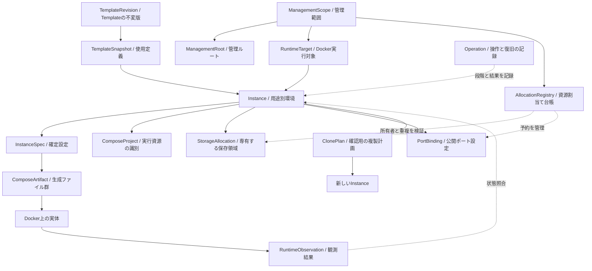
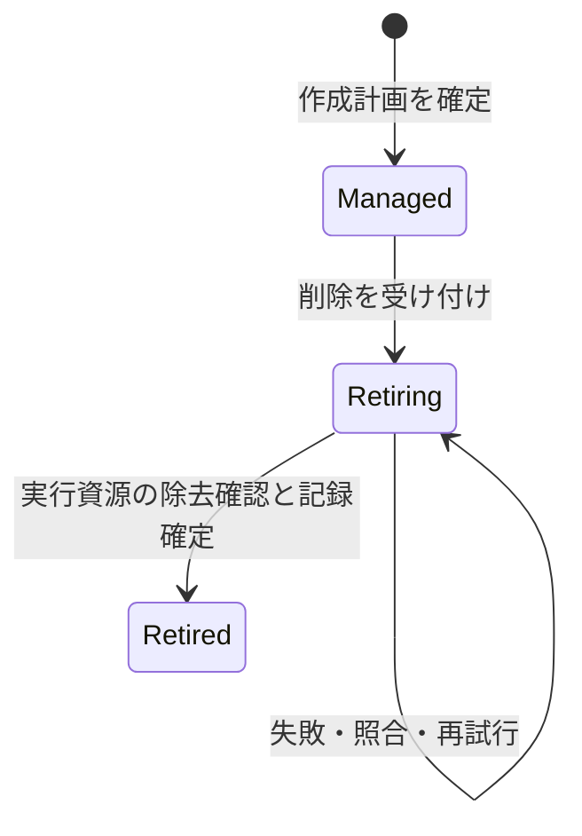
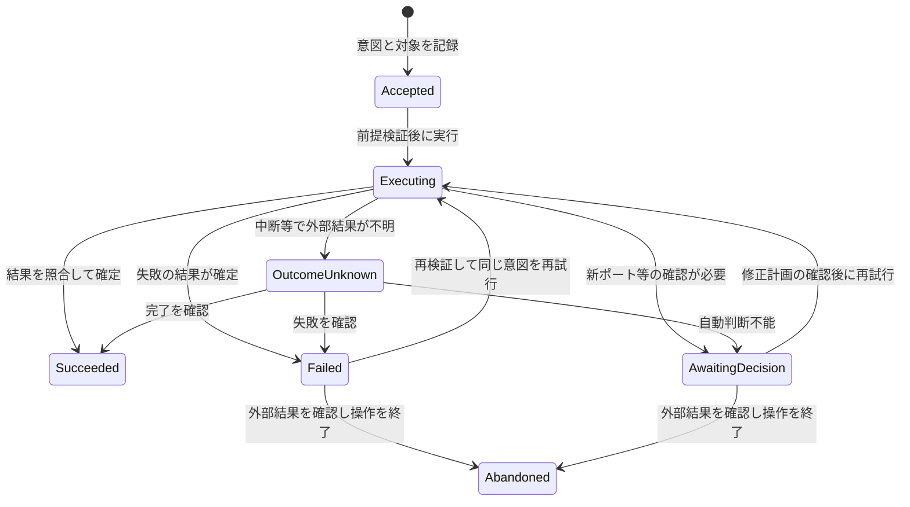

# ComposeNest v1 ドメインモデル

作成日: 2026-09-21\
状態: 初版。要件定義を具体化した設計上の決定。ユーザー指定の確定方針と、今回の設計判断を区別する\
上位文書: [企画書](product-proposal.md)、[v1 要件定義書](requirements-v1.md)

後続仕様: [v1 Clone Policy仕様](clone-policy-spec.md)。生成器、Policy評価、ポート探索順、計画の確認と再試行は同仕様で具体化する。

Templateの宣言・Version解決・出所の扱いは[v1 Template Schema仕様](template-schema-spec.md)で具体化した。ユーザー作成定義にも不変版とSnapshotの規則を適用する。

## 1. 目的と適用範囲

この文書は、ComposeNestが何を管理するか、その同一性・関係・所有範囲・状態・安全条件を定める。中心はTemplateから作成するInstanceであり、コンテナの状態を保存するだけのモデルにはしない。

v1の対象はWindows x86_64の64bit OS、macOS ARM64、Ubuntu 26.04。保存はbind mountが既定でnamed volumeも選択でき、秘密情報は平文保存、日本語UI、React／Tauri／Rust／SQLiteを採用する。管理ルートはシステム共通領域に置く。これらの上位方針は変更しない。

v2のコンテナWeb版に必要な実行場所の区別は残すが、ユーザー・組織・認可・クラスタ・バックアップ・データ移行のモデルを先取りしない。クラス、Rustの型定義、DBテーブル、SQL、TemplateのYAML構文、CLIコマンド列、ディレクトリの具体的な階層は本書で決めない。

本文中の英語名は設計上の識別名であり、UIで表示する日本語やプログラム上の命名を固定するものではない。「集約」は、関連する変更をまとめて安全条件を守る単位を意味し、必ず1テーブルや1クラスへ実装するという意味ではない。

## 2. 今回の主要な決定

| ID | 決定 | 理由 |
| --- | --- | --- |
| DM-01 | Instanceを独立した識別子を持つ管理単位にする | 表示名やコンテナが変わっても同じ環境を扱うため |
| DM-02 | 1 Instanceに1 Compose Projectと1主要サービスを割り当てる | v1の利用単位と操作範囲を一致させるため |
| DM-03 | Templateの版を不変とし、Instanceに使用定義のスナップショットを保持する | 既存環境とCloneがTemplate更新で変わらないため |
| DM-04 | 設定、生成物、実行観測を別の情報として管理する | 設定保存とDockerへの反映を混同しないため |
| DM-05 | 確定済みInstance設定と変更申請中の設定を分ける | ポート編集失敗時に旧設定と新設定を区別するため |
| DM-06 | ポート・Project名・保存領域の割当てを横断的に管理する | 別Instanceとの競合はInstance単体では防げないため |
| DM-07 | 設定Cloneの計画と、実行するOperationを分ける | 確認前にデータ領域を作らず、確定後の再試行は同じ環境を継続するため |
| DM-08 | 管理ライフサイクル、実行状態、操作結果、一致状況を分ける | 一つのRunning／Failed列では状態を正確に表せないため |
| DM-09 | 削除後もInstanceの最小記録と保存領域の所有関係を残す | データの所在を失わず、後の作成で再利用させないため |
| DM-10 | 管理ルート、Docker実行対象、ポート競合範囲を区別する | v2で管理コンテナ内のパスやポートをDockerホストと混同しないため |
| DM-11 | 秘密値は設定の一部として扱い、差分・通知は機密指定に従って伏せる | 平文保存方針と表示上の保護を両立するため |
| DM-12 | 同じInstanceへの変更操作は一度に1つとする | 二重作成、編集と削除の衝突、再試行の重複を避けるため |

## 3. 概念と関係の全体像

実線は主な関係や変換、点線は照合や制約を示す。図はクラス図や物理データモデルではない。

| 関係 | 多重度・所有上の意味 |
| --- | --- |
| 管理範囲 → 管理ルート | v1では1つ。OSごとの具体パスは保存基盤が解決する |
| 管理範囲 → 実行対象 | v1では1つ。将来の複数接続先UIは実装しない |
| TemplateRevision → Instance | 1つの版を0個以上のInstanceが利用できる |
| Instance → TemplateSnapshot | 確定したInstanceは必ず1つを保持する。カタログからの削除に連動しない |
| Instance → ComposeProject | 1対1。ProjectはInstanceに従属し、単独で変更しない |
| Instance → StorageAllocation | 0個以上。永続化対象ごとに1つ。同梱Templateでは1個以上 |
| Instance → PortBinding | 0個以上。公開ポートの用途ごとに識別する |
| Instance → Operation | 履歴は0個以上。未解決の変更操作は最大1つ |
| Instance → ComposeArtifact | 現在の生成物は最大1組。編集中は旧版と候補版の情報を保持できる |
| Instance → RuntimeObservation | 最新の観測は最大1組。未観測は正常な初期状態 |
| Clone元 → Clone先 | 由来の参照のみ。寿命や削除の連鎖は持たない |

## 4. 管理範囲・識別・名前

### 4.1 ManagementScope

1つのアプリ管理データと資源割当てを整合させる範囲を表す。v1ではシステム共通の管理ルートを利用する1つの管理範囲を持ち、単一のOS利用者が管理する。共通フォルダーだから全OSユーザーで共有してよいとは扱わない。

保持するのは管理範囲の識別、管理ルート、実行対象、新規作成用の既定保存方式などである。既定方式の変更は以後の新規作成に適用し、既存Instanceや開いている確定済み計画を変更しない。Cloneの初期方式はアプリの既定値ではなく元Instanceに従う。

### 4.2 ManagementRootとRuntimeTarget

| 概念 | 意味 | 所有しないもの |
| --- | --- | --- |
| ManagementRoot | アプリの状態・定義・生成物・bindデータを置く論理的な保存基点 | Docker named volumeのデータ実体 |
| RuntimeTarget | 操作するDocker環境の識別と、その接続を照合するための情報 | 現在のシェルのContext名そのもの |
| PortCollisionScope | 同じホストポートを同時使用できない範囲の識別 | InstanceやProjectごとの独立した名前空間 |

v1では管理するDocker実行対象を1つに制限する。PortCollisionScopeもそのローカルホストの1範囲とする。将来、接続先が複数になっても同じホストの複数Engineを別のポート空間と決めつけない。

RuntimeTargetには設定した接続先と、同じ対象であることを確認する証拠を持たせる。Context名が同じでも実体が変わる場合を考慮し、照合不能・不一致なら変更操作を止める。再インストールされたEngineを同じものと認める手順はアーキテクチャ設計へ委ねる。

### 4.3 名前と識別子

| 値 | 本書で定める規則 |
| --- | --- |
| InstanceId | 作成確定時に割り当てる不変の識別子。名称やパスから逆算しない。削除後も別環境へ再利用しない |
| DisplayName | 前後のUnicode空白を除去し、NFC正規化後に1〜100 Unicodeスカラー値。改行・制御文字を拒否。日本語を許可 |
| 表示名の重複 | 正規化後の完全一致を有効な管理Instance間で拒否。大小文字や全半角を勝手に同一視しない。紛らわしい名前の追加注意はUIで検討可能 |
| ComposeProjectName | 表示名と分離した内部名。不変のInstance識別から生成し、実行対象内で一意。具体的な書式はCompose生成仕様で定める |
| TemplateId／TemplateRevision | サービス定義の安定した識別子と不変の版。Schema版・イメージVersionとは別物 |
| StorageSlotId／PortSlotId | Template内で用途を識別する安定キー。日本語ラベルや配列位置を識別に使わない |
| OperationId | 1つの変更意図を識別する。再試行でも維持し、試行番号を進める |

100文字相当の上限と正規化は今回の設計判断である。見た目の文字数と完全に一致するとは限らないため、厳密なカウント方式はUI説明へ直に露出させない。表示名はパスやシェル引数の構造を組み立てる素材として使わない。

削除済みの表示名は新規環境で利用してよいが、内部ID・Project名・残存保存領域は再利用しない。未完了の削除中Instanceは表示名を保持する。

## 5. Templateモデル

### 5.1 TemplateRevision

Templateの「ある版の定義」を不変の単位として扱う。以下を含む。

- Template ID、定義版、Schema版、内容の同一性を照合する情報。
- サービスの種類、対応条件、イメージと選択可能なVersion。
- 入力項目の型・初期値・Validation・機密指定・表示メタ情報。
- 設定から実行構成を組み立てる対応、公開ポート、永続化slot、準備完了条件。
- Clone Policyと許可する組込み生成方法。

同じID・同じ版で異なる内容を上書きしない。更新は別版として追加する。同一版が複数ある場合も読み込み順では解決しない。

Templateの公開状態は「使用可能」「無効」「カタログから除外」を区別する。不正な定義や未対応Schemaは新規作成に使わない。カタログから除外されても、既存Instanceが保持する有効なスナップショットは残す。スナップショット自体が破損・未対応の場合は再生成やCloneを止め、別版へ自動置換しない。

### 5.2 TemplateSnapshot

Instanceが実際に使った定義内容を保持する値である。Template IDと版だけを外部ファイルへ参照する構造にしない。Templateの入力既定値とは別に、Instanceの確定値を保存する。

SnapshotはそのInstanceのPassword等の実値を含める場所ではない。実値はInstanceSpecに属する。Clone先はSnapshotを値として保持でき、元Instanceやカタログの寿命に依存しない。

### 5.3 Templateで上書きできない制約

新しいIDとProjectの割当て、書込み可能な保存領域の分離、予約ポートの一意性、元環境の非変更、禁止された実行権限はCore側の制約とする。Templateが`copy`を指定しても内部IDや保存領域の共有を許可しない。不適切なPolicyは読込み検証で拒否する。

新サービスへの拡張はv1で許可する宣言能力の範囲とする。条件付きフォーム、任意プログラム、データClone処理などを本書で追加しない。

## 6. Instanceモデルと設定の正本

### 6.1 Instanceの構成

Instanceは、内部ID、表示名、管理範囲、実行対象、TemplateSnapshot、確定したInstanceSpec、Project、保存領域の所有情報、管理ライフサイクル、操作との関連を持つ。

Clone元IDは由来として任意に保持する。元Instanceの削除を禁止する外部依存や、削除の連鎖にはしない。生のコンテナIDはInstanceの識別子にせず、観測された実行資源として扱う。

### 6.2 InstanceSpec

InstanceSpecは、ある版の確定設定である。選択したサービスVersion、通常設定、秘密値、保存方式、各slotへの割当て、公開ポート、Templateで定める実行設定を含む。

v1では全ての書込み可能な永続化slotに同じ保存方式を適用する。1 Instance内でbind mountとnamed volumeを混在させるUIは追加しない。ただしslotごとに領域は分離して識別する。生成設定ファイルの読取り専用マウントは、このデータ保存方式の選択とは区別する。

| 設定の区分 | 同じInstanceでの扱い |
| --- | --- |
| 表示名 | 操作中でなければ変更可能。実行構成の版は変えず、Instanceの更新版を進める |
| 公開Host Port | 停止を確認して変更可能。新しい設定版の適用が必要 |
| 内部ID、実行対象、Project | 不変 |
| 保存方式、保存領域 | 作成確定後は不変。失敗後の再試行でも同じ割当てを使う |
| Image／Version、DB名、Username、Password | v1のEditでは変更不可。新規作成・Clone確認時だけ指定できる |
| Restart Policy等 | Templateに含められるが、作成後の汎用編集はv1外 |

初回作成後のポート競合復旧は、失敗した作成Operationに新しいポート計画を明示承認して適用する例外とする。保存領域やPasswordまで再生成する理由にはしない。

### 6.3 確定設定・変更予定・反映記録

| 情報 | 意味 |
| --- | --- |
| CommittedSpec | 現在の確定設定。初回作成ではDocker起動前に確定するため、利用可能であることを意味しない |
| PendingChange | ポート編集・競合復旧の変更予定。旧版、新版、ユーザーが確認した差分を操作に保持する |
| GeneratedSpecRevision | 現在の生成物がどの設定版から作られたか |
| AppliedSpecRevision | Docker実体へ反映できたと最後に確認した設定版。未反映なら未設定 |
| ObservationTime | その事実を確認した時刻。過去のApplied情報だけで現在の一致を保証しない |

ポート編集は、候補の保存だけでCommittedSpecを置き換えない。外部反映と停止状態の確認を終え、割当て台帳の切替えとともに確定する。途中の画面では旧接続先と変更予定を区別し、どちらも利用可能と断言しない。

Compose生成に不要な表示名変更でも、Instance更新版を進めて古い画面からの更新を検出する。Instance更新版と実行設定版を分けることで、単なる名前変更でコンテナを再作成しない。

## 7. Composeと実行観測

### 7.1 ComposeProjectとComposeArtifact

ComposeProjectは実行対象内で対象資源をまとめる識別であり、Instanceに従属する値とする。独立したProject編集機能や複数Instanceによる共有を設けない。

ComposeArtifactは標準のComposeと必要な補助ファイルのまとまりである。Instance ID、Project、設定版、生成方式の版、出力先、内容の照合情報を持つ。ファイルは設定の正本ではない。v1ではユーザーの直接CLI起動を利用機能として提供しない。

現在のファイル内容が最後の生成内容と異なる場合は「外部変更あり」とする。ファイルが存在するだけで再実行してよいとは判定しない。管理対象の照合にProject名だけを使わず、Instanceとの対応・管理印・構成の観測結果を合わせて確認する。具体的な印やハッシュの構成はアーキテクチャ設計で定める。

### 7.2 RuntimeObservation

外部から観測した事実のまとまりであり、ユーザーの要求や正本設定と区別する。

- 観測した実行対象、時刻、結果の信頼性。
- コンテナの存在と識別、実行状態、準備完了条件の結果。
- 実際の公開ポート、保存領域、Project・Instanceの対応。
- 取得できなかった場合の理由。

接続不可・権限不足で確認できないときは、以前の観測を履歴として残しつつ現在状態を確認不能とする。未作成や停止中へ変換しない。ReadyはTemplateの準備完了条件を満たす意味で、DBの任意ユーザー認証やネットワーク全体の疎通を保証しない。

DBの中身はドメインオブジェクトとして読み取らない。保存領域の識別と初期化の可能性を記録するだけであり、レコード数やDBスキーマをClone判定の正本にしない。

## 8. 保存領域モデル

### 8.1 StorageAllocation

「Instanceが専有するデータ保存領域の割当て」を表す。Instance ID、StorageSlotId、方式、論理割当てID、実行対象、実体を指す情報を持つ。

| 方式 | 実体の指定 | 新規作成時の判定 |
| --- | --- | --- |
| BindMount | 管理ルート内の相対的な領域キーと、Dockerホスト側の解決済みパス | 管理されたデータ領域配下であること、他領域との同一・親子重複がないこと、既存データを取り込まないこと |
| NamedVolume | 実行対象と一意なvolume実名 | 同名の既存領域がなく、他の有効・残存割当てと共有しないこと |

BindMountはDBやTemplateを置く管理領域までコンテナに公開しない。管理ルート配下であることだけでは十分でなく、指定されたデータ領域内であることを必要条件とする。

パスの比較は文字列の前方一致だけで判断しない。OSの実体解決、リンク、親子関係等の証拠を外部基盤から取得し、Coreは「安全に分離できる」という判定結果を必要とする。実体の安全な照合ができなければ操作を止める。

### 8.2 割当てと実体の状態を分ける

| 観点 | 状態 | 意味 |
| --- | --- | --- |
| 所有 | Assigned | 有効なInstanceへ割当て済み |
| 所有 | Retained | Instance削除後も残す領域。新規環境へ割り当てない |
| 実体 | NotMaterialized | まだ実体を作った証拠がなく、安全に新規作成できる段階 |
| 実体 | Present | 割当てに一致する実体の存在を確認した |
| 実体 | Missing | 以前作成された領域が存在しないと確認した |
| 実体 | Unverified | 対象へ接続できない、所有情報が不一致、作成直後の中断等で判断できない |
| 初期化 | NotAttempted | サービスをこの領域へ起動した記録がない |
| 初期化 | MayHaveInitialized | 初期化処理が走った可能性がある。中断や失敗でもこの段階になり得る |
| 初期化 | ReadyObserved | この領域を使ったサービスの準備完了を観測済み |

MayHaveInitializedから「空の領域」へ自動で戻さない。DBの起動が失敗しても一部データが書かれている可能性がある。ReadyObservedはDBの全データの完全性を保証する印ではない。

作成前に割当て情報を記録し、外部で作成した後に存在の証拠を記録する。中断後に同じパスや名前が見つかっても、それだけで所有物として取り込まない。Operationと資源の照合ができるときだけ同じ領域の作成途中として再開し、証拠不足はUnverifiedとして保留する。

Missingは「コンテナがない」と異なる。コンテナだけがない場合は同じデータで再作成できるが、過去に存在したデータ領域がない場合は、空領域を自動で作らない。

### 8.3 Cloneと保存方式

新規作成はアプリ設定の既定方式を使う。Cloneは元の方式を初期値にし、確認画面で変更できる。いずれも、確定後の全slotに新しいStorageAllocationを割り当てる。

bind→namedやnamed→bindは新しい空環境の構成選択であり、データ移行ではない。元の割当てID・パス・volume実名をコピーしない。初期データがイメージ側から作られる場合でも元Instanceのデータをコピーしたとは扱わない。

## 9. 資源割当て台帳とポート予約

### 9.1 AllocationRegistry

Instance横断の重複を防ぐ台帳を、Instanceとは別の整合性単位にする。有効な表示名、Compose Project識別、保存領域識別、公開ポートの所有者を管理する。実体のDB配置はここでは決めない。

| 資源 | 重複判定の範囲 | 解放するタイミング |
| --- | --- | --- |
| 表示名 | ManagementScope内の有効Instance | 名称変更確定または削除完了 |
| Project名 | RuntimeTarget内 | 削除後も履歴に残し、別Instanceへ再利用しない |
| bind保存先 | 同一ホストのデータ保存領域 | 削除後もRetainedとして保持 |
| named volume実名 | RuntimeTarget内 | 削除後もRetainedとして保持 |
| Host Port | PortCollisionScope、待受アドレス、プロトコル、番号 | 設定切替え完了または削除完了 |

この台帳は他アプリや別のComposeNest管理データに対する排他ロックではない。外部のポート占有と既存保存領域も検証し、台帳にないことだけで利用可能と判定しない。

### 9.2 PortBindingとPortReservation

PortBindingは設定であり、PortSlotId、Host IP、Host Port、Container Port、プロトコルを持つ。PortReservationはその公開先をどのInstanceが使う予定かという台帳上の権利である。

v1は127.0.0.1／TCP、Host Portは要件案の1024〜65535を対象とする。Template内のcontainer側ポートはHost Portとは別に扱い、別Instanceで同じ値を利用してよい。

| 予約状態 | 意味 | 他Instanceへの割当て |
| --- | --- | --- |
| Held | 作成・編集・復旧処理が確保した候補 | 不可 |
| Committed | 現在の確定設定が使う予約。Instanceが停止・起動失敗でも保持 | 不可 |
| Released | 旧設定からの切替え・削除完了で解放した記録 | 外部占有の検証後に可能 |

プレビューの候補は予約ではない。v1では確認画面を開いただけで永続予約を取らず、確定時に再検証する。Heldを一定時間経過だけで解放せず、そのOperationが外部へ反映済みか照合する。アプリ異常終了は予約解放の条件にしない。

初回作成はInstanceと確定設定とCommitted予約を論理的に同時確定してから外部へ進む。編集では旧Committedと新Heldを一時的に共存させ、成功時に新Committedへ切り替える。複数ポートを持つ場合は集合として割当て可能か判定し、一部だけ取得して作成完了にしない。

### 9.3 競合確認の対象

停止中を含む管理予約、同時処理のHeld、Dockerの割当て、Docker以外のホストプロセス、OSの制限を確認する。観測後に他プロセスが占有する競合は残るため、空き確認の結果は実行成功の保証にしない。

起動時に競合したら、新しい候補の確認を求める。承認後も同じInstance・Operation・保存領域・秘密値を保ち、ポート変更計画だけを更新する。旧ポートを使う自分の実体が残っていないと確認してから旧予約を解放する。

## 10. ClonePlanと作成計画

作成前の入力と確認結果をCreationPlanとして扱い、元環境を参照するものをClonePlanとする。永続的なユーザー用下書き機能はv1に追加しない。画面を閉じると破棄できる一時的な計画である。

| 保持する情報 | 意味 |
| --- | --- |
| 計画の識別・版 | 確認した内容と作成要求を対応させる。古い確認画面の値で確定しない |
| 元Instance IDと更新版 | Cloneにのみ存在する。元のどの確定値を使ったかを識別 |
| TemplateSnapshot | 利用する定義を固定 |
| 入力と生成済み候補 | 表示名、選択Version、保存方式、ポート、秘密値等 |
| 項目別の差分 | copy、regenerate、nextAvailable、clear、askの適用結果と入力完了状況 |
| 競合確認の結果と時刻 | 現時点の候補に過ぎず、確定時に再確認する |
| ユーザーの確認対象 | データ非複製、方式、ポート変更、秘密値の引継ぎ等 |

計画内で生成したPasswordは単なる再描画で作り直さない。ユーザーが再生成を選ぶ、入力を変更する、または計画を作り直す場合のみ変更する。作成確定後はInstanceSpecへ固定する。

内部IDや保存先は計画段階では候補として表示できるが、その時点で実体を作らない。候補が確定時に変わり、確認画面に示した意味のある値が変わる場合は計画を更新して再確認する。

### Clone確定時の元環境の変化

- 元Instanceの更新版が同じで、変更操作中でなければ、保存した確定値を基に進む。
- 表示名や設定が変わった、削除された、未解決の編集に入った場合は計画を無効化し、再表示を要求する。
- 単なる実行状態の変化は設定を変えないため、起動中から停止中になっただけで計画を無効化しない。
- 計画から新Instanceを確定した後は元環境と独立し、その後に元が変更・削除されてもClone先を巻き戻さない。

v1では削除済みInstanceからの新規CloneをUIへ提供しない。Clone先は由来の識別だけを保持し、元の存在を動作条件にしない。

## 11. 整合性を守る単位と責務

| 単位 | 所有する責務 | 他の単位との関係 |
| --- | --- | --- |
| ManagementScope設定 | 既定方式、管理ルート、実行対象の設定 | Instance設定を遡って変更しない |
| TemplateRevision | 不変な定義の妥当性 | InstanceにはSnapshotとして引き渡す |
| Instance | 同一性、確定設定、Project・領域の所有、管理ライフサイクル | 横断的な重複は台帳と協調して確定 |
| AllocationRegistry | Instance間の資源一意性と予約 | 外部占有の検証は別途必要 |
| Operation | 変更意図、段階、候補版、試行、結果、復旧 | 対象Instanceに未解決の変更は最大1つ |

StorageAllocationとComposeProjectはInstanceに従属し、独立したユーザー操作単位にしない。削除後もInstanceの記録へ従属させる。RuntimeObservationとComposeArtifactは実行状況・生成の証跡であり、設定の正本を持つ別の管理主体にはしない。

Instance確定・表示名確保・全ポート予約・領域識別割当て・Operation開始は、一部だけ確定した成功状態を見せないよう論理的な一括処理にする。SQLite内の保存とファイル／Docker操作までを単一トランザクションとして扱わない。

アプリケーション層が台帳・Instance・Operationと外部処理を調整する。ドメインの規則はUIから独立させ、空きポートやパスを調べるためにCoreが直接OSやDockerを呼ぶ設計を必須にしない。外部検証の結果と識別情報を受け取って可否を判断できる形にする。

イベント通知は操作結果をUI等へ伝えるために利用できるが、イベントソーシング、メッセージブローカー、分散トランザクションはv1の前提にしない。

## 12. 状態モデル

### 12.1 管理ライフサイクル

- **Managed:** アプリが有効な環境として管理する。起動前・作成失敗・停止中も含む。
- **Retiring:** 削除意図を受け付け、除去・照合中または再試行待ち。データと予約を保持する。
- **Retired:** 有効な一覧から外れ、ポート・表示名を解放済み。設定と残存データの識別を保持する。

v1でRetiredからの復活機能は提供しない。Retiringでは削除以外の変更と新規Cloneの受付を止める。削除前の確認画面を閉じることはできるが、実行後の取り消しを安全にできるとは約束しない。

### 12.2 実行観測状態

| 状態 | 意味 |
| --- | --- |
| Unknown | 対象の状態を現在確認できない、または未観測 |
| Absent | 対象へ接続して対象コンテナが存在しないと確認した |
| Stopped | 対象コンテナが存在し、停止していると確認した |
| Preparing | 実行中で準備完了待ち |
| Ready | 実行中かつTemplateの準備完了条件を満たす |
| Unhealthy | 準備完了条件の失敗や異常を観測した |

再起動ループや対象の一部だけが存在するなど、単純な状態へまとめられない観測は診断理由を付ける。ユーザーの停止操作による停止と、予期しない終了を同じ成功結果にはしない。

これらの遷移はコマンド送信ではなく観測で確定する。外部変化があるため固定的な順序を強制しない。例えばReadyから取得不能になればUnknownとなり、Absentと確認できた場合だけAbsentになる。

### 12.3 Operationの状態

失敗・確認待ち・結果不明は操作の成功完了ではない。同じInstanceへ新しい変更を受け付ける前に、再試行または安全な終了を行う。AbandonedはInstanceやデータの削除ではなく、その操作意図を追求しないという結果である。例えば失敗した初回作成を終了してから、そのInstanceの削除操作へ進む。

Abandonedへ移る前にも実体を照合し、未完了のポート編集は旧設定への復帰または新設定の確定が必要である。結果不明のままロックや必要な予約だけを解放しない。作成前の計画キャンセルはOperationを作らないため、この状態機械の外にある。

### 12.4 一致状況とUIでの合成

生成物の一致状況、実行設定の一致状況、保存領域の存在は別々に持つ。生成物が一致しても実行構成が旧版の可能性がある。

| 状況 | 表示すべき意味 |
| --- | --- |
| Managed、Operation失敗、実体Ready | 「直前の操作に失敗／現在サービスは実行中」。操作成功へ勝手に書き換えない |
| Managed、観測Unknown | 「状態を確認できません」。直近観測時刻を添える |
| Managed、観測Absent、領域Present | 「コンテナ未作成」。データの再利用条件を満たせば起動で再作成可能 |
| Managed、領域Missing | 「保存領域が見つかりません」。空の環境として自動起動不可 |
| Retiring、Operation失敗 | 「削除に失敗／再試行が必要」。一覧・予約は保持 |
| Retired、領域Retained | 通常一覧から除外し、「データは保持済み」と所在情報を残す |

確認済みの他環境との不一致や外部改変は、Ready観測があっても変更操作の停止理由になる。

## 13. Operationの内容・前提条件

Operationには対象Instance、種類、対象更新版、変更前後の設定版、要求された結果、段階、試行番号、外部実行前後の記録、エラー識別子を持たせる。再試行ごとの試行番号は増やすが、同じ操作意図ならOperation IDを維持する。

| 操作 | 開始条件 | 成功条件 |
| --- | --- | --- |
| Create／Clone | 有効な計画と入力、割当て可能、実行対象一致 | 生成・検証・起動が完了しReadyを観測 |
| Start | Managed、設定が利用可能、保存領域健全、対象一致 | 既存領域を保持してReadyを観測 |
| Stop | Managed、対象資源を識別可能 | 自分の対象が停止または存在しないと観測 |
| Restart | Managed、自分のコンテナが存在し設定照合可能 | 現行設定の再起動後にReadyを観測 |
| Rename | Managed、未解決の変更操作なし、名前が利用可能 | 表示名と台帳を更新。コンテナ・設定版・保存先は不変 |
| EditPort | Managed、未解決操作なし、StoppedまたはAbsentを観測、必要な領域が健全 | 新構成を反映して停止を確認。確定設定と予約を切替え |
| Delete | ManagedまたはRetiring、対象と所有が照合可能、削除意図を確認済み | 自分の実行資源の除去を確認しRetiredへ移行。データは保持 |

安全のため停止する操作まで、不要にファイル改変検知だけで妨げない。Stopは改変Composeを実行せず対象コンテナの所有を確認できる場合に許可する。同様にDeleteは自分の対象資源を完全に識別できる場合のみ進める。識別手段がない場合は保留する。

コンテナがないInstanceへのEditPortは、要件の「停止中」をサービスが稼働していない状態として具体化したもの。構成反映のため再作成する場合も、最後は停止状態にする。実際のCLI手順は本書に含めない。

読取り、ログ取得、実行観測は変更操作とは分け、必要な範囲で継続できる。情報を表示できることを変更操作の許可とみなさない。Rename等のローカル操作でも、古い更新版からの上書きを拒否する。

## 14. 代表的な処理と復旧

### 14.1 作成・Clone

1. 計画を生成し、ユーザーが必要な値を確認する。この段階でDBデータ領域は作らない。
2. 入力、Template、対象、元環境の版、名前、全ポート・保存領域候補を再検証する。
3. Instance ID、確定設定、全割当て、Operationを一括して記録する。ここから新しいInstanceが成立する。
4. 新規保存領域を準備し、生成物を書き出す。実行前後の段階を記録する。
5. 構成検証後に起動する。初期化の可能性を記録し、実体と準備完了を観測する。
6. 結果を確定する。失敗時もInstanceと必要な予約を保持し、同じ割当てで復旧する。

Clone元へ停止・保存変更・Password変更を送らない。1つでも元の書込み領域への参照が残れば検証不合格とする。

### 14.2 ポート編集

1. 対象が稼働していないことと、変更前設定・生成物・実体の整合を確認する。
2. 旧Committed予約を維持したまま、変更する全ポートの新Held予約とPendingChangeを記録する。
3. 新設定の生成・検証・実体反映を行う。保存領域と認証情報は変更しない。
4. 新構成で停止していることを観測する。
5. CommittedSpecと新予約を切り替え、旧予約を解放し、Operationを成功にする。

3〜4で失敗した場合は、既存の設定を反映できたふりをしない。新構成への再試行か、同じOperation内で旧構成へ復帰するかを選ぶ。旧構成の復帰ではデータを書き戻す処理を行わず、旧ポート構成を再生成・反映して停止を確認する。新構成・旧構成のどちらが存在するか不明な間は両方の必要な予約を維持する。

新構成をDockerへ反映した後にアプリが終了しても、記録されたPendingChangeと実体を照合して確定を続行できる。旧CommittedSpecが残っていることだけを根拠に即座に旧構成を再実行しない。

### 14.3 削除

1. 未解決操作があれば先に照合して終了させる。削除対象とデータ保持を確認する。
2. Retiringにし、削除Operationを記録する。
3. 対象のコンテナと専用ネットワーク等を除去する。bindデータ・named volumeは削除しない。
4. 対象実行資源の不在と保持対象を確認する。Engineへ接続できないことを削除成功にしない。
5. Retired記録と保存領域のRetained化、ポート・表示名の解放を一括で確定する。

専用ネットワーク等に管理外資源が関連していて所有を確認できない場合は、強制的に除去しない。削除失敗として理由と残りの対象を示す。残存ファイルの置き場所を変えるかは保存設計で決めるが、秘密値を含む可能性と保護は削除後も維持する。

RetiredのProjectが外部操作で再び現れた場合、自動復活も自動削除もしない。新規割当て時の外部占有確認対象とし、把握できた残存実行資源を診断する。v1の直接CLI操作支援を追加する意味ではない。

### 14.4 異常終了後の照合

| 発見した状態 | 判断と対応 |
| --- | --- |
| 計画のみ・未確定 | 破棄可能。永続データと予約はない |
| Instance確定、領域未作成 | 同じID・名前・秘密値・割当てで作成を再開できる |
| 同名領域は存在するが所有証拠不足 | Unverifiedとして保留。既存データを取り込まない |
| 初期化を開始したがタイムアウト | MayHaveInitializedを保持。実体とReadyを再観測し、空領域扱いに戻さない |
| 新ポート構成が反映済み、DB確定は旧版 | PendingChangeと実体が一致すれば新設定の確定へ進む |
| 削除実体は不在、Retiringのまま | 保存領域と対象を照合し、Retiredと予約解放の確定を続行 |
| 実行対象へ接続できない | OutcomeUnknown／Unknownを維持し、必要な予約を解放しない |

自動処理できるのは、記録と観測により安全に同じ意図を続行・確定できる場合に限る。初期化済みデータの上書き、別対象への操作、所有不明資源の取り込みは復旧処理として正当化しない。

## 15. 不変条件

以下は通常処理、Clone、再試行、削除の全経路で守る。

| ID | 条件 | 要件との対応 |
| --- | --- | --- |
| INV-01 | 同じInstanceのID・RuntimeTarget・Project・領域所有は操作や再試行で変わらない | BR-03、CRT-07、CLN-10 |
| INV-02 | Clone先は元と異なるID・Project・全書込み領域を持つ | BR-05・07、CLN-03・08 |
| INV-03 | 有効な同一公開先を、競合範囲内の別Instanceへ二重予約しない | BR-06、PRT-03・04 |
| INV-04 | 停止・失敗・アプリ終了だけでは予約を解放しない | PRT-06、REC-03 |
| INV-05 | 再試行は確定済みの秘密・領域を再生成しない | CRT-07、CLN-10、REC-05 |
| INV-06 | 以前存在した保存領域の消失を新規初期化で隠さない | STO-10 |
| INV-07 | 生成ファイルや観測値を、未確認のまま確定設定へ取り込まない | BR-04、CRT-08 |
| INV-08 | Templateの更新・除外は既存の使用定義を変えない | TPL-06 |
| INV-09 | 1 Instanceへ同時に複数の未解決な変更操作を持たない | MGT-10、NFR-06 |
| INV-10 | 操作送信・CLI終了だけでReadyや削除成功を決めない | REC-02・04、MGT-07 |
| INV-11 | 削除はデータ破棄ではなく、Retired化と実行資源除去である | BR-09、MGT-07 |
| INV-12 | 秘密値は通常表示・差分・イベントに含めず、機密として扱う | SEC-01〜05 |
| INV-13 | 管理外・所有不明の資源を変更対象としない | SEC-07、REC-08 |
| INV-14 | 表示言語、表示名、画面や通信方式にドメイン識別を依存させない | NFR-02・09、FUT-01 |
| INV-15 | 新規作成の既定方式変更で既存Instanceの方式が変わらない | STO-02・08 |
| INV-16 | ポート切替えは旧予約を先に捨てず、反映確認後に確定する | MGT-06、OPN-09 |

## 16. 通知・エラー・表示の境界

ドメインが返すのは安定した理由識別子と必要な非機密情報とする。日本語文言を永続的な状態キーにしない。

| 通知・理由の例 | 含める情報 | 含めない情報 |
| --- | --- | --- |
| InstanceCreated | Instance ID、設定版、作成／Cloneの区分 | Passwordの実値 |
| ConfigurationChangeCommitted | 対象ID、旧版・新版、変更項目の識別 | 無加工の全設定や秘密入りCompose |
| PortConflict | PortSlotId、候補、管理予約／外部占有／判定不能 | 他環境の認証情報 |
| StorageMissing／OwnershipUnverified | 対象ID、slot、領域の識別と理由 | DBの内容 |
| OperationNeedsDecision | Operation ID、段階、選択可能な復旧操作 | 自動的に危険な処理を実行する指示 |
| InstanceRetired | 対象ID、残した領域の所在 | 秘密値の表示 |

秘密値の読取りは明示的な表示・コピーのユースケースへ限定する。平文保存を暗号化済みの型名等で誤表現しない。秘密の配置や権限、Composeへの展開は保存・生成の設計で決める。

## 17. モデルを確認するシナリオ

| 場面 | モデル上の結果 | 受入シナリオ |
| --- | --- | --- |
| AppA PostgreSQL停止中、5432予約済み。AppBへClone | 元のCommitted予約を保持。先に別ポート、新Project、新StorageAllocationを割当て | AC-05・07 |
| 元がbind mount、先をnamed volumeへ変更 | Snapshotと設定値は利用し、方式と全領域割当てを先用に作る。データ参照は移さない | AC-06 |
| Clone起動が失敗しDB初期化の可能性あり | 同じInstance・Operationで再試行。MayHaveInitializedと秘密値を保持 | AC-09 |
| AppAの表示名を変更 | Instance更新版と表示名台帳だけ変更。Project、パス、実行設定版は保持 | AC-12 |
| 5432→5433編集の途中でアプリ終了 | 旧Committed、新Held、PendingChangeから実体を照合。未確認でいずれも解放しない | AC-08・14 |
| コンテナだけがなくデータは存在 | AbsentとPresentの組合せ。同じ領域を使って再作成可能 | AC-04 |
| dataディレクトリまたはvolumeが消失 | Missing。空の領域へ置換せず案内する | AC-11 |
| 元Instanceを削除 | 元はRetired、データRetained。Clone先は由来参照以外に依存せず継続 | AC-13 |
| Templateファイルを更新・削除 | 既存のSnapshotとCommittedSpecは不変 | AC-16 |
| Context名は同じだが接続先が変わった | RuntimeTarget不一致として変更保留 | AC-15 |
| Docker停止中に一覧を開く | Managedは維持し、実行観測はUnknown。停止扱いにしない | AC-01 |

## 18. 要件の具体化と残る設計事項

### 18.1 今回具体化した事項

- OPN-06のうち、識別の意味、表示名の正規化・上限、Template版とSnapshotの関係を決めた。
- OPN-09のうち、旧・新設定の保持、新ポートのHeld予約、反映確認後の確定、失敗時の復帰条件を決めた。
- 管理削除とデータ保持をRetired／Retainedで表現し、有効登録の削除を物理レコードの消去と同一視しないことを決めた。
- 1 Instance内のデータ保存方式は統一し、複数の永続化slotを同方式の独立領域へ割り当てることを決めた。
- 確認用計画は永続予約を取らず、確定時に再検証する方針を決めた。

これらは今回の設計判断であり、今後の仕様検証で上位要件と矛盾が分かれば理由を記録して更新する。

### 18.2 後続文書へ委ねる事項

| 成果物 | 決める内容 | 本モデルから固定して引き継ぐもの |
| --- | --- | --- |
| Clone Policy仕様 | 型別の適用可否、生成器、探索順、`ask`の完了条件、計画変更時の再確認 | 元非変更、全領域再割当て、秘密値維持、予約確定境界 |
| Template Schema仕様 | 宣言構文、Version別設定、slot定義、値検証、内容同一性、digest方針 | 不変版・Snapshot、安定キー、Coreの安全条件を上書き不可 |
| アーキテクチャ設計 | SQLiteとファイルの配置、排他・一括確定、外部処理の記録、生成物照合、RuntimeTarget識別方法 | 設定と実体の分離、Operation再試行、同一性と所有条件 |
| 配布・保存設計 | 管理ルートの他OSパス確定、初期作成、所有者・ACL、コンテナ権限、依存版 | システム共通領域、平文保存、単一利用者、named volume実体はDocker管理 |
| UI設計 | 差分、確認待ち、再試行、保持データの所在、状態の優先表示 | 状態の各軸、秘密マスキング、確定前の値を利用可能としない |

外部変更からの管理再開は、アーキテクチャ設計で「確認後の退避と保存設定からの復帰」を具体化し、ユーザー採用済み。Engine再登録、Retired記録の長期整理は詳細を未決とし、v1で任意資源の取込みや完全削除を追加する理由にはしない。Ubuntuは26.04のx86_64（64bit）のみで確定。Windows／macOS最低版は環境要件の残件であり、ドメイン識別の規則には入れない。

後続の**Clone Policy仕様とTemplate Schema仕様は作成済み**。本書の不変条件を踏まえ、項目ごとの振る舞いと宣言形式を具体化した。PostgreSQLとRedisの定義例を用意し、[アーキテクチャ設計](architecture-v1.md)で保存・検証・実行・UIの責務を定めている。定義例の実機検証は[v1 実装タスク一覧](https://github.com/wix-diesel/ComposeNest/issues/56)の受入タスクに含める。
